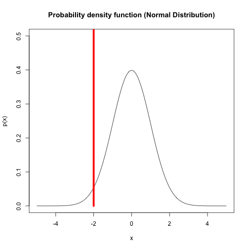

--- 
title       : An interactive quantile computing tool
subtitle    : Compute normal distribution quantile from mu and p
author      : Michael Hu
job         : 
framework   : io2012        # {io2012, html5slides, shower, dzslides, ...}
highlighter : highlight.js  # {highlight.js, prettify, highlight}
hitheme     : tomorrow      # 
widgets     : [] # {mathjax, quiz, bootstrap}
mode        : selfcontained # {standalone, draft}
knit        : slidify::knit2slides

--- bg:lightyellow

## Problem Motivation 

- Quantile computing is quite commonly needed in statistics, e.g.,
  - median, ith quantile
  - hypothesis testing
  - confidence intervals
  - Q-Q plots
- An interactive web quantile tool can be handy 
- Shiny makes creating the tool super easy

--- .class #id bg:lightyellow

## Design 

- Inputs
  - Use slide bars for mu and probability
  - Standard deviation fixed to 1 for simplification
- Outputs
  - Plot probability density function
  - Plot the vertical line to illustrate the quantile point

--- .class #id bg:lightyellow

## Implementation

Example plot when mu = 0 and p = 0.025

 

--- .class #id bg:lightyellow

## Future Enhancements

- Add input for stand deviation
- Add other distribution types

